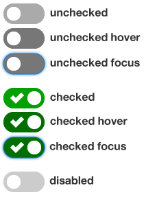
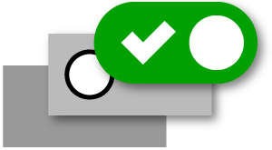
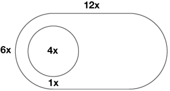

# Checkbox and radio button switch

Demo version: https://russmaxdesign.github.io/switch-checkbox/

The simple example demonstrates how to style checkbox and radio button elements to look like **on/off** switches.

<h3>HTML markup</h3>
<pre><code>&lt;div class="switch"&gt;
  &lt;!-- input --&gt;
  &lt;input
    class="switch__control"
    type="checkbox"
    name="example01"
    id="example01"&gt;
  &lt;!-- label --&gt;
  &lt;label class="switch__label" for="example01"&gt;
    &lt;span class="switch__content"&gt;Label content&lt;/span&gt;
  &lt;/label&gt;
&lt;/div&gt;
</code></pre>

<h3>BEM naming</h3>

Class names follow <a href="https://en.bem.info/">BEM</a> class naming
  conventions.

<pre><code>/* parent module */
.switch { }

/* descendants of parent module */
.switch__control { }
.switch__label { }
.switch__content { }
</code></pre>

<h3>Accessibility</h3>

The input and label elements are explicitly associated using matching "for"
and "id" values.

The label content is used to describe the purpose of each switch for screen
readers. This content is hidden off-screen.

The switch is keyboard-friendly, so there is a visible focus
state available for checked and unchecked switches.

<figure>
  
</figure>

The colors used for the switch meet WCAG 2.0 color contrast guidelines and
work well for all major types of color blindness.

A tick symbol is used for the checked state to make this state clearly
distinguishable from the unchecked state. This is important for low vision
users as well as conginitive impaired users.

The tick is an SVG image, defined using background-size. This means it can
be scaled up or down as needed without dithering issues.

<h3>Styling the three elements</h3>

There are three key elements of the switch: the parent (<code>switch</code>), the input (<code>switch__control</code>) and the label (<code>switch__label</code>).

<figure>
  
</figure>

The <b>parent</b> element (<code>switch</code>) is set with a width and a height and given <code>position: relative</code>.

The <b>input</b> element (<code>switch__control</code>) is positioned on top of the <code>switch</code> and sized to the same width and height. This means that the entire area of the switch is then clickable. It is also set with <code>opacity: 0</code>, which means it is not visible.

The <b>label</b> element (<code>switch__label</code>) is then positioned
on top of the input element, and also sized to the same width and height as
the <code>switch</code> element. It is also given a <code>border-radius</code>
to create the round corners. Finally, this label can then be given different
<code>background-color</code> and <code>background-image</code> values
depending on its state (ie. whether it is checked, unchecked, disabled, in
focus, in hover state etc).

<h3>Styling the different states</h3>

Checkbox and radio button elements can given various states such as
checked, unchecked or disabled.

However, most of the styling is applied to the label element, rather than
the input. Unfortunately, the label element has no checked, unchecked or
disabled state of its own.

We can get around this by styling the label after an input that is checked,
unchecked or disabled.

This can be achieved using adjacent sibling selectors, which target any
label element that is adjacent to the input.

<pre><code>/* unchecked input */
.switch__control:hover + label { }
.switch__control:focus + label { }

/* checked input */
.switch__control:checked + label { }
.switch__control:checked:hover + label { }
.switch__control:checked:focus + label { }

/* diabled input */
.switch__control[disabled] + label { }
</code></pre>

<h3>SASS Variables</h3>

The switch uses the ratio below for dimensions:

<figure>
  
</figure>

A single "master" variable is used to control all dimensions, which
means the component can easily be scaled to different sizes as needed.

<pre><code>$switch-width: 3em;
$switch-height: ($switch-width / 2);
$toggle-width: ($switch-width / 3);
$toggle-gutter: ($switch-width / 12);
</code></pre>

Different sized switches can be created by changing the font-size of each
option.

<pre><code>$switch-xl:  1.6em;
$switch-lg:  1.4em;
$switch-md: 1.2em;
$switch-sm: 1em;
$switch-xs: .8em;
</code></pre>

See [Licence information](LICENCE) for use.
